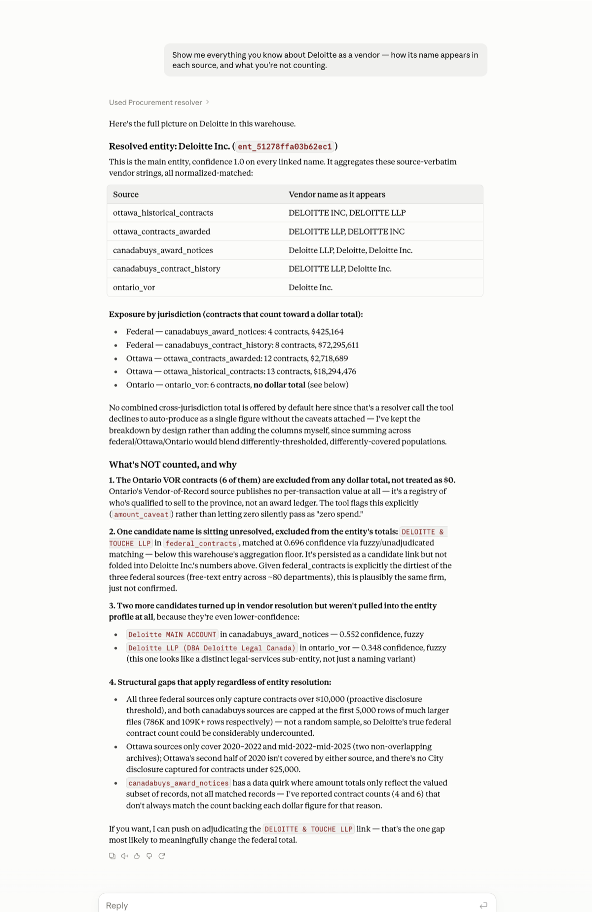
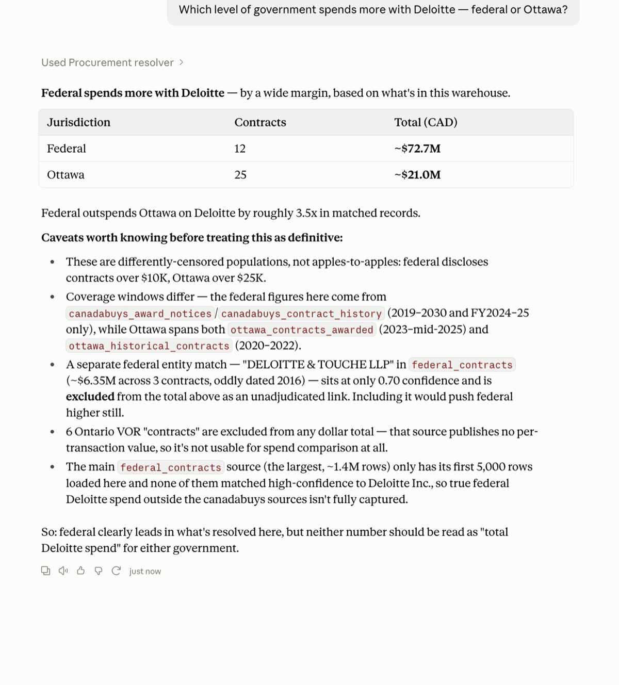
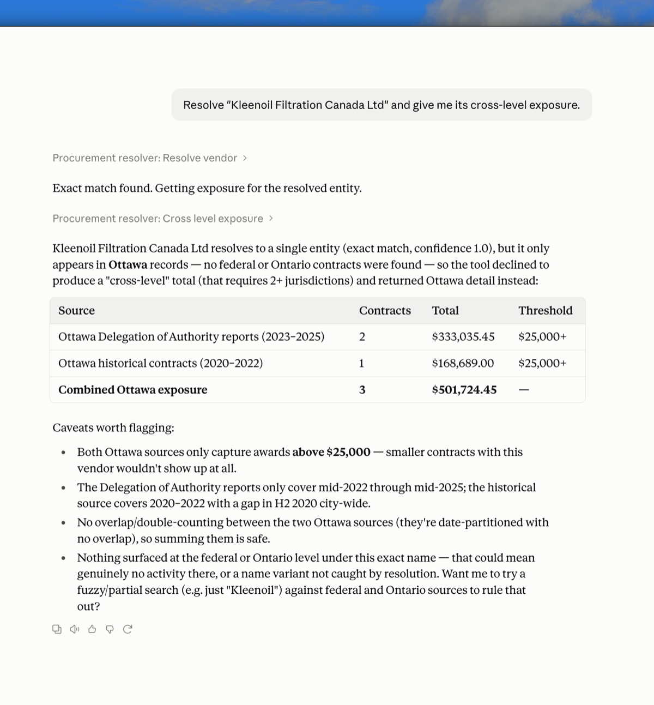

# Cross-Jurisdictional Procurement Resolver

[](https://github.com/adamkaegi/procurement-resolver/actions/workflows/ci.yml)

Canadian public procurement is published at three levels of government — federal,
provincial (Ontario), and municipal (City of Ottawa) — that share no schema, no vendor identifier, and
no common publication format. A firm holding contracts at all three levels is
invisible as a single entity to every existing system, and the three levels
disclose contracts above three different dollar thresholds, so even a "total
spend" question is comparing differently-censored populations unless something
says so.

This repo builds two things:

1. **An adapter layer** that ingests federal, Ontario, and City of Ottawa
   procurement data into one canonical schema (a deliberate subset of
   [OCDS 1.1](https://standard.open-contracting.org/)), with mapping
   configs reviewed per source and cross-jurisdictional vendor resolution on top.
2. **An MCP agent** — five typed tools, no free-text SQL — that answers
   cross-jurisdictional questions over the resolved data with resolution
   confidence attached, and is built to decline rather than guess when the
   underlying resolution or coverage can't support a claim.

The domain is a corpus, not the point. The same shape shows up consolidating
ERPs after an acquisition, joining insurance claims across carriers, or
reconciling provider registries across hospital systems: different
vocabularies for the same entities, no common key, and a deadline. Full
framing and design rationale: [`docs/SPEC.md`](docs/SPEC.md).

## Try it

- **[The Register](https://adamkaegi.github.io/procurement-resolver/)**
  — a static, filterable browser over the resolved warehouse: every ingested
  contract, plus every vendor resolved across two or more jurisdictions, with
  the same coverage caveats the MCP tools return. No setup required. Built
  by `scripts/build_register.py`, published from the `gh-pages` branch.
- **The MCP agent**, from your own machine, talking to a real MCP client
  (e.g. Claude Desktop) — see [Connecting an MCP client](#connecting-an-mcp-client) below.

## What an answer looks like

Two real `cross_level_exposure` responses from the live warehouse (trimmed —
per-source `known_gaps` arrays omitted). First, a vendor that genuinely
resolves across levels of government:

```jsonc
{
  "canonical_name": "BELL CANADA",
  "declined": false,
  "overall_confidence": 1.0,
  "exposures": [
    { "jurisdiction": "federal", "source_id": "federal_contracts",
      "contract_count": 10, "total_amount": 4579921.67, "value_threshold": 10000.0 },
    { "jurisdiction": "federal", "source_id": "canadabuys_award_notices",
      "contract_count": 4,  "total_amount": null,
      "amount_caveat": "All 4 included contract(s) ... show $0 ... Excluded from the dollar total rather than silently included as $0." },
    { "jurisdiction": "ottawa", "source_id": "ottawa_contracts_awarded",
      "contract_count": 14, "total_amount": 1823618.92, "value_threshold": 25000.0 },
    { "jurisdiction": "ottawa", "source_id": "ottawa_historical_contracts",
      "contract_count": 5,  "total_amount": 7982143.21, "value_threshold": 25000.0 }
  ]
}
```

And the same tool on a vendor the data *can't* support a cross-level claim
for — it declines with a reason instead of fabricating a total:

```jsonc
{
  "canonical_name": "KLEENOIL FILTRATION CANADA LTD",
  "declined": true,
  "decline_reason": "This entity currently resolves to records in only 1 jurisdiction(s). Cross-level exposure requires more than one to be meaningful; returning per-source detail instead of a cross-level total.",
  "exposures": [
    { "jurisdiction": "ottawa", "source_id": "ottawa_contracts_awarded",
      "contract_count": 2, "total_amount": 333035.45 },
    { "jurisdiction": "ottawa", "source_id": "ottawa_historical_contracts",
      "contract_count": 1, "total_amount": 168689.0 }
  ]
}
```

The refusal is the point: confidence and coverage caveats ride along on
every answer, and where they can't support a claim, the tool says so.

### The same tools, driven by an MCP client

Three unedited sessions against the local server from Claude Desktop — no
extra code, no hosting, no auth (setup in [`docs/AGENT_DEMO.md`](docs/AGENT_DEMO.md)).
Click any image for full size.

<p align="center">
  <a href="docs/images/mcp-entity-profile-deloitte.png">
    
  </a>
</p>

**`entity_profile` — the evidence, including what isn't counted.** Five
source-verbatim spellings (`DELOITTE INC`, `DELOITTE LLP`, `Deloitte`,
`Deloitte Inc.`, `Deloitte LLP`) resolve to one entity spanning all three
jurisdictions. The second half of the answer is the part that matters: six
Ontario VOR records held out of any dollar total because that source
publishes no per-transaction value; one candidate link persisted at 0.696
and excluded from every figure until someone adjudicates it; and two
weaker near-matches (0.552, 0.348) left standing as separate entities.
Nothing is silently merged, and nothing uncertain is silently counted.

<p align="center">
  <a href="docs/images/mcp-coverage-caveats-deloitte.png">
    
  </a>
</p>

**Coverage caveats, unprompted.** Asked a straightforward comparison
question, the agent answers it and then explains why the answer shouldn't
be trusted as stated: different disclosure thresholds ($10K federal,
$25K Ottawa), different coverage windows, and the fact that the largest
federal source contributes *no* high-confidence links to this entity at
all — so the federal figure rests entirely on the two CanadaBuys sources.

<p align="center">
  <a href="docs/images/mcp-declined-kleenoil.png">
    
  </a>
</p>

**The decline, end to end.** The same `cross_level_exposure` refusal shown
as JSON above, arriving at a user through a real client: no cross-level
total, a stated reason, and the Ottawa detail returned anyway.

The `ent_…` identifiers visible in these sessions are content-hashed from
the warehouse build they were captured against. A rebuild from freshly
fetched sources can produce different ids for the same firms.

## Architecture at a glance

```
data/raw/<source>/<timestamp>/   archived raw payloads, immutable, never re-fetched
        │
        ▼
apply_mapping.py / extract_documents.py / ingest_ottawa_open_data.py
        │            (deterministic; each mapping.yaml is executed by a generic interpreter)
        ▼
validate.py            (every record checked against schema/ocds_subset.json)
        ▼
load.py                → data/warehouse.duckdb : releases
        ▼
resolve.py              token blocking → rapidfuzz scoring → confidence bands
        ▼
                        → entity, entity_token, entity_link, coverage
        ▼
agent_tools.py + server.py   five typed MCP tools, confidence + coverage
                              caveats on every answer, refusal below threshold
```

Single-file DuckDB, no server, no Docker, no cloud infrastructure — see
[`CLAUDE.md`](CLAUDE.md) for the full set of rules this repo is built under
(source immutability, no fabricated metrics, no `run_sql` tool, etc.), which
override the usual defaults throughout this codebase.

| Layer | Where |
|---|---|
| Canonical schema | `schema/ocds_subset.json` |
| Per-source config (fetch, licence, mapping) | `sources/<source_id>/` |
| Pipeline code | `src/` |
| Warehouse (gitignored, rebuildable) | `data/warehouse.duckdb` |
| MCP server + tools | `src/server.py`, `src/agent_tools.py` |
| Tests (code correctness) | `tests/` |
| Evals (model/pipeline behaviour) | `evals/` |
| Decision log / progress / known failures | `docs/` |

## Setup and running locally

Requires Python 3.11 and [`uv`](https://docs.astral.sh/uv/).

```bash
uv sync                          # install dependencies into .venv
uv run python scripts/rebuild.py # rebuild data/warehouse.duckdb from data/raw/ (no network)
uv run pytest                    # deterministic code-path tests, no network, no model
uv run ruff check .              # lint
```

`scripts/rebuild.py` is the one-command reproducibility path: it reads only
the already-archived raw payloads under `data/raw/`, applies each source's
mapping/extraction, validates every record, loads the warehouse, and rebuilds
the `entity` / `entity_link` / `coverage` tables. It makes no network calls
and calls no model.

`data/raw/` itself is not checked into this repository (see
[`CLAUDE.md`](CLAUDE.md) rule 2 — source payloads are archived locally,
never re-fetched or modified in place, and not redistributed), so the full
rebuild only runs on a machine that has the archived payloads. **From a
cold clone, what works immediately:** `uv sync`, `uv run pytest` (the two
tests that need archived data skip themselves — same as CI), and the
published Register site above. Each source's official download URL and
licence are recorded in `sources/<source_id>/source.yaml` if you want to
fetch your own copies; the archival helper they were fetched through is
`src/fetch.py`.

### Connecting an MCP client

The agent has no bespoke UI on purpose — any MCP client can drive
`src/server.py` for free, and a general-purpose client is a more convincing
demo than a one-off chat widget. Full walkthrough, exact Claude Desktop
config, and a scripted example pairing a confident answer with a correct
refusal in one session: **[`docs/AGENT_DEMO.md`](docs/AGENT_DEMO.md)**.

Quick reference, the five tools (`src/agent_tools.py`, wired in `src/server.py`):

| Tool | Returns |
|---|---|
| `resolve_vendor(name, jurisdiction?)` | ranked entity candidates with confidence and evidence |
| `entity_profile(entity_id)` | every contract behind a resolved entity, across jurisdictions |
| `cross_level_exposure(entity_id)` | totals by jurisdiction — declines below a confidence/coverage floor |
| `compare_buyers(jurisdictions, category?)` | buyer aggregates with threshold caveats attached |
| `coverage(jurisdiction?, date_range?)` | what the warehouse actually holds, and its known gaps |

No `run_sql` tool — typed tools only, per `CLAUDE.md` rule 4.

## Status

6 sources ingested (23,426 records), a working end-to-end rebuild
(`scripts/rebuild.py`, ~45s), a resolved entity layer (8,916 entities,
483 of them resolved across two or more jurisdictions, with the uncertain
match band persisted separately and excluded from every total until
adjudicated), a working MCP server with real refusal logic verified
against the live warehouse, and a real logged local-LLM
mapping-generation run in
[`evals/results/llm_calls.jsonl`](evals/results/llm_calls.jsonl). Full
detail: [`docs/PROGRESS.md`](docs/PROGRESS.md).

Every design decision — deterministic vs. LLM, and every architectural
trade-off — is logged with its rejected alternative in
[`docs/DECISIONS.md`](docs/DECISIONS.md). Specific, named vendor-resolution
failure modes (numbered companies, parent/subsidiary pairs, a real scoring
false positive) with root causes are in
[`docs/FAILURES.md`](docs/FAILURES.md).

This project's thesis is that a reliability claim needs a number behind it
(`CLAUDE.md` rule 1: no precision, recall, cost, or latency figure appears
anywhere unless an eval run produced it) — so stated plainly rather than
implied: mapping-quality precision/recall, resolution precision/recall, and
agent refusal-rate are **not measured, by decision**. A scored evaluation
set was cut from scope ([`docs/SPEC.md`](docs/SPEC.md) Part 3), not left
half-finished — the decision log, failure catalogue, and live agent demo
above are what this project uses to demonstrate reliability instead.

## License

Code in this repository is MIT-licensed — see [`LICENSE`](LICENSE). The
underlying government procurement data is **not** redistributed via this
repo (`data/raw/` is gitignored) and remains subject to its own source
licence in each case — see `licence` / `licence_url` in every
`sources/<source_id>/source.yaml`.
